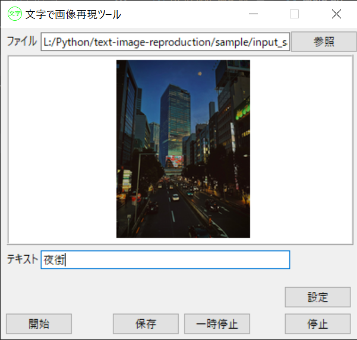
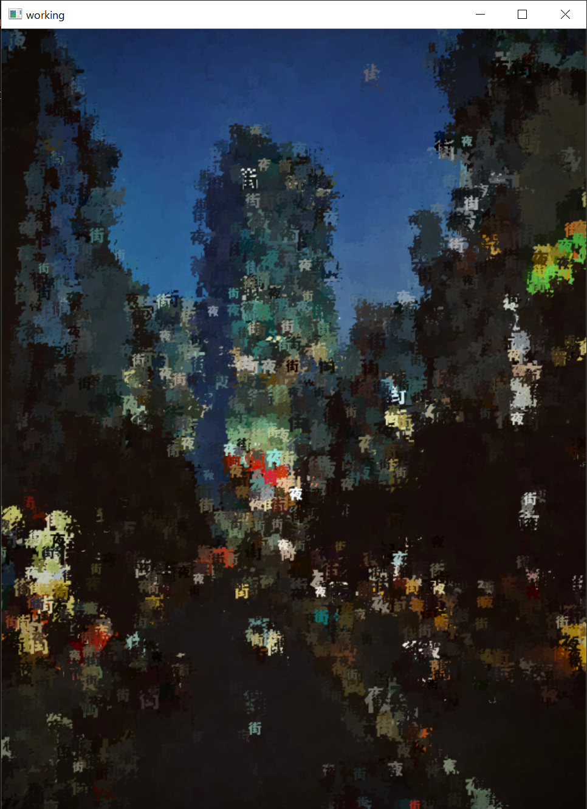

# text-image-reproduction
メインGUI&emsp;&emsp;&emsp;&emsp;&emsp;&emsp;&emsp;&emsp;&emsp;&emsp;&emsp;&emsp;&emsp;&emsp;&emsp;&emsp;&emsp;&emsp;&emsp;&emsp;&emsp;&emsp;&emsp;実行ウインドウ

→

文字で画像を再現するプログラムです。
2022年の2月ごろに作成しました。
大学の講義で扱った基本的な画像処理を活用したオリジナルプログラムの作成、
tkinterを使ったGUIの勉強を目的としたものです。